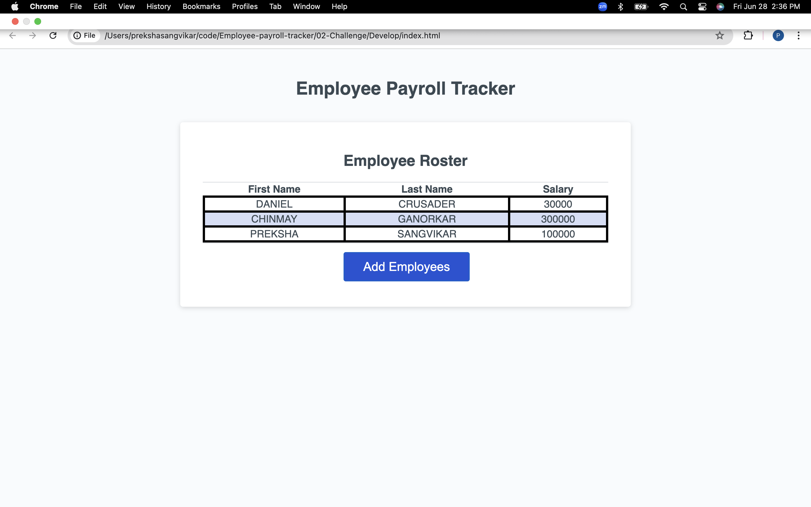

# Emp-tracker-new
Challenge-week3
# Employee-payroll-tracker
Challenge-03
## User Story

```md
AS A payroll manager
I WANT AN employee payroll tracker
SO THAT I can see my employees' payroll data and properly budget for the company
```

## Acceptance Criteria

```md
GIVEN an employee payroll tracker
WHEN I click the "Add employee" button 
THEN I am presented with a series of prompts asking for first name, last name, and salary -------->done 
WHEN I finish adding an employee
THEN I am prompted to continue or cancel --------->done
WHEN I choose to continue
THEN I am prompted to add a new employee-------->done
WHEN I choose to cancel
THEN my employee data is displayed on the page sorted alphabetically by last name, and the console shows computed and aggregated data----->done 
```


## Screenshot of the page

. ----------> Press (cmd + right click ) for macOS.


